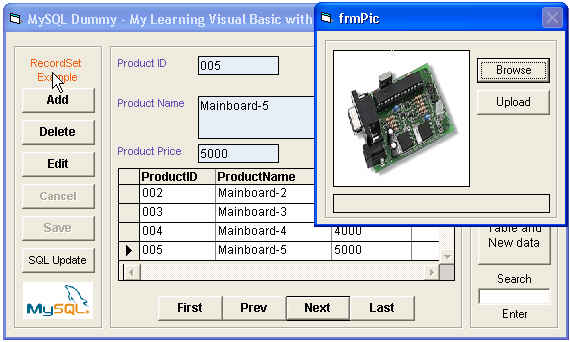



## \_For Dummy \- VB with MySQL Sample of using VB access data Text and Picture \<Last Update 8 May 2004\>

### Description

Sample of using VB access data from a MySQL database (Create Table ,Add ,Edit ,Delete ,Search ,Show and Upload Picture) for beginner. Tester with mysql-4.0.18 for Win32 and MyODBC-3.51.06.exe ***MySQL Server configure (set to no password) username:root port:3306 database:test

< Last Update 24 Dec 2004 ...Search Function >
 
### More Info
 

             |
---                |---
**Submitted On**   |2004-05-08 17:00:28
**By**             |[visualbasic\-mysql\.blogspot\.com](https://github.com/Planet-Source-Code/PSCIndex/blob/master/ByAuthor/visualbasic-mysql-blogspot-com.md)
**Level**          |Beginner
**User Rating**    |4.7 (47 globes from 10 users)
**Compatibility**  |VB 6\.0
**Category**       |[Databases/ Data Access/ DAO/ ADO](https://github.com/Planet-Source-Code/PSCIndex/blob/master/ByCategory/databases-data-access-dao-ado__1-6.md)
**World**          |[Visual Basic](https://github.com/Planet-Source-Code/PSCIndex/blob/master/ByWorld/visual-basic.md)
**Archive File**   |[\_For\_Dummy174307582004\.zip](https://github.com/Planet-Source-Code/visualbasic-mysql-blogspot-com-for-dummy-vb-with-mysql-sample-of-using-vb-access-data-text__1-53570/archive/master.zip)

